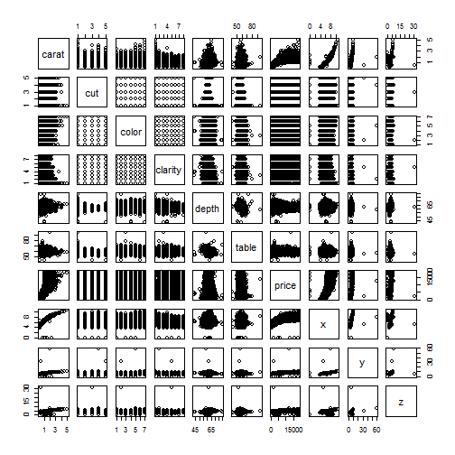

Diamonds Explorer
========================================================
author: DDP Shiny App Pitch Presentation (cryptoknight7)
date: 21 Sep 2014
font-family: 'Helvetica'
autosize: true
transition: rotate
transition-speed: slow


Introduction
========================================================
The purpose of this slidify presentation is to pitch the **Diamonds Explorer** Shiny application built for the Coursera `Developing Data Products` course.

Outline:
- Show raw `diamonds` data.
- Plot the `diamonds` data.
- Summarize need for Shiny application.


Raw Diamonds: Sneak Preview
========================================================
*This snapshot view of the raw `diamonds` data shows the fields available and a couple sample values for each entry.*


```r
names(diamonds)
```

```
 [1] "carat"   "cut"     "color"   "clarity" "depth"   "table"   "price"  
 [8] "x"       "y"       "z"      
```

```r
head(diamonds,n=2)
```

```
  carat     cut color clarity depth table price    x    y    z
1  0.23   Ideal     E     SI2  61.5    55   326 3.95 3.98 2.43
2  0.21 Premium     E     SI1  59.8    61   326 3.89 3.84 2.31
```


Diamonds Plot: Multi-dimensional Data Set
========================================================
*This plot shows the various dimensions in the `diamonds` data set, and gives the user a sense for the many different relationships to be discovered within the data.*

 


Summary
========================================================
- By now, the need is surely clear for **Diamonds Explorer**, the premier solution for quickly identifying and understanding the mystifying, complex relationships between diamond carats, cuts, color, and more!

     - Check out the **[Diamonds Explorer](https://cryptoknight7.shinyapps.io/DDP-ShinyApp-DiamondsExplorer/)** now!

